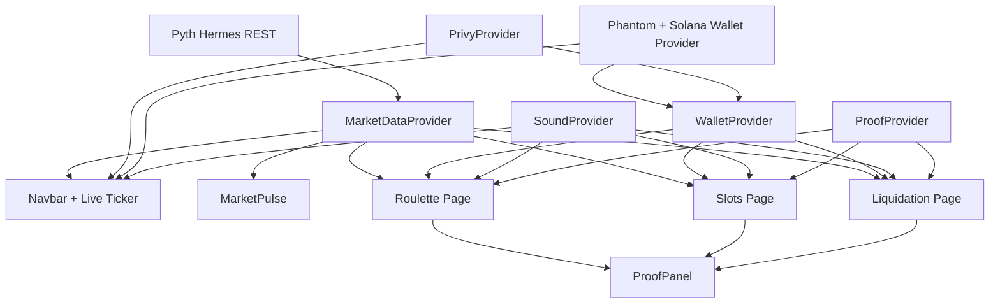

# Architecture

This document describes how market data, authentication, wallet funding, game balance, and proof records interact in Pyth Casino.

## High-Level System

## Runtime Composition

`app/layout.tsx` wraps the app in this order:
1. `PrivyAuthProvider`
2. `WalletProvider`
3. `SoundProvider`
4. `MarketDataProvider`
5. `ProofProvider`
6. `Navbar` + route content

This keeps game pages simple by reading shared hooks rather than managing duplicated fetch/auth logic.

## Market Data Pipeline

Implemented in `context/MarketDataContext.tsx`.

- **Anchor cadence**: fetches `BTC/ETH/SOL` via Hermes every `2500ms`.
- **Render cadence**: emits simulated ticks every `250ms`.
- **Smoothing**: interpolates from last anchor to next anchor.
- **Jitter**: adds bounded micro-jitter (`max ±0.001%`) for a live tape feel without exposing timing exploits.
- **History**: stores a ring buffer of up to `180` ticks per asset.
- **Failover**: if Pyth API fails, uses `enableMockTemporarily()` to generate mock prices for 30s before automatically retrying the live REST API.

Each asset state includes:
- current/previous price
- direction (`up/down/flat`)
- 15s change %
- rolling volatility value + tier
- market mood label
- danger level
- tick history

## Volatility + Mood Engine

Implemented in `lib/volatility.ts`.

- Rolling volatility = scaled RMS of log-returns over a `40`-tick window.
- Tier thresholds:
  - `LOW < 0.18`
  - `MEDIUM < 0.45`
  - `HIGH >= 0.45`
- Mood thresholds (absolute 15s move):
  - `<0.35%` -> `Market Calm`
  - `<1.2%` -> `Market Volatile`
  - `>=1.2%` -> `Market Insane`
- Game mappings:
  - Slots multiplier: `1.00x / 1.35x / 1.85x` by tier
  - Roulette payout: base `1.9x` with boosts `+0.00 / +0.20 / +0.45`
  - Liquidation difficulty scalar: `1.0 / 1.35 / 1.8`
  - Danger bands: `SAFE/WATCH/DANGER/CRITICAL`

## Game Engines

### Roulette (`app/roulette/page.tsx`)
- Locks round entry price and payout multiplier at bet time.
- Uses shared market stream for end price and live display.
- Resolves win/loss by direction vs start/end price.
- Uses the same persisted casino balance flow as the other games.
- Records proof payload with volatility tier + source.

### Slots (`app/slots/page.tsx`)
- Uses a provider-based randomness layer for symbol outcomes.
- Current provider: `local`.
- Future provider path: `pyth_entropy_v2` scaffolded behind env selection.
- Applies volatility multiplier from live BTC tier.
- Captures optional randomness seed/provider/request reference in proof record.
- **Security:** Defers outcome calculation deep inside React timeouts to prevent refresh-dodging. Enforces a 2.5s rate-limit cooldown.
- Shows overlay and proof panel after spin resolution.

### Liquidation (`app/liquidation/page.tsx`)
- Simulates leveraged PnL loop at `500ms`.
- Increases adverse pressure using volatility-driven danger.
- Uses mathematically secure `crypto.getRandomValues(new Uint32Array(1))` API instead of `Math.random` for all internal PnL random walks.
- Allows manual cash-out; otherwise triggers liquidation state.
- Records proof on liquidation or cash-out completion, rigorously preventing double-proofs via locked execution flags.

## Proof of Outcome

Implemented via:
- `lib/proof.ts` (types + helpers + share formatter)
- `context/ProofContext.tsx` (in-memory rolling history, max 5)
- `components/ProofPanel.tsx` (post-round verification UI)

Recorded fields per round:
- `startPrice`, `endPrice`, `timestamp`
- `asset`
- `volatilityLevel`
- `result` (`win/loss`)
- `randomnessSeed` (slots when available)
- `dataSource` (Hermes / Pyth)
- `signature` (HMAC cryptographic hash combining seed, asset, result, and price points to prevent forgery)

## Authentication and Wallet

- `components/PrivyAuthProvider.tsx` initializes Privy identity.
- `components/SolanaProvider.tsx` and `components/PhantomWalletButton.tsx` provide the Phantom wallet rail.
- `context/WalletContext.tsx` is the casino ledger adapter:
  - deposits and withdrawals use native SOL
  - balances are persisted in Postgres
  - game rounds consume the persisted app balance instead of requiring wallet signatures every time

Current model:
- identity is real (Privy)
- deposits/withdrawals are on-chain via Phantom
- gameplay is casino-style and runs against the app ledger for instant UX

## Audio and Feedback

- `lib/sound.ts` uses Web Audio API tone synthesis.
- `context/SoundContext.tsx` controls mute state and unlock behavior.
- `components/ResultOverlay.tsx` provides animated win/loss/liquidated overlays.
- `components/Toast.tsx` and `components/Tooltip.tsx` support lightweight UX feedback.
